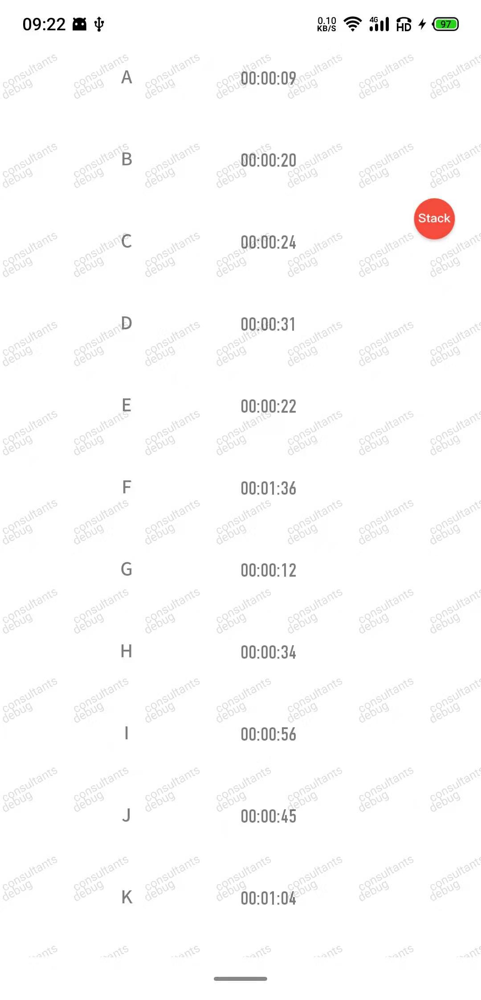

# Android

#### 介绍
销售家是一款完整的android项目,您可以用基础功能来快速开发任意业务需求!!!🚀🚀🚀

#### 软件架构
1. MVVM(未采用DataBinding)
2. [Fragmentation单Activity+多Fragment模式](https://github.com/YoKeyword/Fragmentation/wiki/2.-API)
3. 迁移AndroidX,支持Kotlin写法

#### 网络层
1. Retrofit2+Rxjava
2. Okhttp配置,支持防中间人攻击(需替换自己的cer)
3. 支持应用内BaseUrl切换
4. 全局网络监听

#### 工具
1. 支持权限一键获取
2. 支持一键登录(免验证码)
3. 自定义ToolBar,Dialog,LinearLayout,自定义View等
4. 支持Zxing扫码
5. 数据库Room+saferoom加密
6. App安装兼容10.0
7. 支持美团Logan日志加密
8. 支持分享
9. 缓存策略,支持定时缓存
10. 内置播放音频(系统提示音+自定义音频文件)
11. 支持仿微信相册选择
12. 内置优化版WebView
13. 内置CountDownTimer倒计时
14. 内置leakcanary监听内存泄漏情况
15. 内置友盟+极光推送服务
16. 支持屏幕适配
17. 支持沉浸式状态栏
18. 内置短信监听验证码功能
19. 支持全部崩溃监听
20. 内置视频播放组件
21. 统一RecycleView+万能Adapter
22. 支持全局字体设置
23. 支持全局水印设置
24. 应用内防截屏

#### 截图

#### 体验Demo(下载密码:123456)

#### 安装教程
下载编译offline work取消勾

